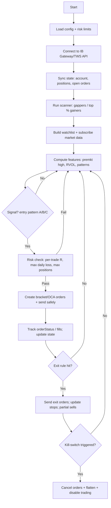

# Development plan for a Ross‑style momentum day‑trading bot in Python using IBKR

## Executive summary

This report describes a theory‑only plan to build a Python trading system that imitates entity["people","Ross Cameron","momentum day trader"]’s momentum day‑trading style: scan for a small number of fast‑moving stocks, buy specific breakouts (price moving above a clear level), manage risk with tight stops (automatic exits), and take profits by selling part of the position and moving the stop to break‑even. The strategy rules are made precise enough to code, backtest on minute data, paper‑trade, and then trade live using entity["company","Interactive Brokers","brokerage"] (IBKR) via entity["software","IB Gateway","interactive brokers gateway"] / entity["software","Trader Workstation","interactive brokers desktop platform"] and the entity["software","TWS API","interactive brokers trading api"]. citeturn19search0turn1search3

Key design idea: split the system into (1) market selection (scanners + filters), (2) signal rules (entries/exits), (3) risk engine (position sizing + daily loss limits), and (4) execution engine (orders + fill tracking). That separation is what keeps the live bot safe and testable.

The highest‑risk parts are (a) data quality (especially pre‑market and halts), (b) realistic fills (slippage [difference between expected and actual fill price]), and (c) IBKR limits (market‑data line limits, request pacing, and login/restart behaviour). citeturn3search8turn8view1turn14search15

## Assumptions and scope

Assumptions (change these as needed, but keep them explicit so the backtest matches reality):

- Account equity: **USD 30,000**, margin account, trading **US listed stocks (STK.US)**. (Chosen so you are not immediately constrained by the classic PDT rule; see compliance section because this may change in 2026.) citeturn16view1turn5search11  
- Instruments: **long only** (buy first, sell later). (Shorting adds locate/borrow constraints and different risk.)  
- Time windows:
  - Pre‑market analysis uses **04:00–09:30 US/Eastern** (when available). citeturn7search7turn7search14  
  - Trading focus is **09:30–11:30** (entity["people","Ross Cameron","momentum day trader"] says mornings are best and he focuses 09:30–11:30). citeturn18view1  
- Style target: “Momentum / Gap‑and‑Go / Bull flag / Flat‑top breakout” entries and scaled exits as described on entity["organization","Warrior Trading","trading education company"]’s pages written by entity["people","Ross Cameron","momentum day trader"]. citeturn17view0turn17view1turn18view1  
- IBKR connectivity: use **TWS API** via **IB Gateway** for stability; TWS API is a TCP socket interface to TWS/IB Gateway. citeturn1search3turn14search0

Terminology used (with simple meanings):
- **Float** (shares available to trade). Low float can move more sharply. citeturn17view0  
- **Gapper** (stock opening much higher than yesterday’s close). citeturn17view1  
- **Breakout** (price goes above a clear “ceiling” level).  
- **Stop** (automatic exit price to cap loss). citeturn18view1  
- **Relative volume** (today’s volume compared with normal; “2×” means twice normal). citeturn18view1  

## Strategy rules

This section turns the “human” style into rules that can be coded. Where entity["people","Ross Cameron","momentum day trader"] is discretionary (judgement‑based), the plan replaces it with measurable thresholds.

### Market selection rules (what symbols are tradable today)

**Primary scan (pre‑market and early session):**
1. **Find gappers**: “scan for all gappers more than 4%” (use % change filter). citeturn17view1  
2. **Prefer low float**: he lists float under **100M**, ideally under **20M**, and notes you may need external tools (Trade Ideas/eSignal) for float. citeturn17view0turn18view1  
3. **Require high relative volume**: target **≥ 2×** relative volume. citeturn18view1  
4. **Catalyst check (optional but recommended)**: “hunt for catalyst (earnings/news/PR)” for gap‑and‑go style. citeturn17view1  

**How this maps to IBKR scanners:**
- Use IBKR scanner “scanCode” like **TOP_PERC_GAIN** and apply filters like **AbovePrice**, **BelowPrice**, **AboveVolume**, **MarketCapBelow** via the scanner subscription object. citeturn0search4turn0search2  
- Note: IBKR scanners do not reliably provide “float”, so float is either (a) an external dataset, or (b) replaced with market‑cap filters as a rough proxy (less accurate). citeturn0search4turn18view1  

### Entry rules (when to buy)

Your bot should implement *at most 2–3 entry patterns at first* to reduce complexity. These three patterns align with entity["people","Ross Cameron","momentum day trader"]’s descriptions.

#### Entry pattern A: Gap‑and‑Go breakout (opening range)

From the “Gap and Go” steps:
- Mark **pre‑market highs**.
- At 09:30, buy the **high of the first 1‑minute candle** (opening range breakout) with a stop at the **low of that candle**, or buy the **pre‑market high**. citeturn17view1  

**Codable version (precise):**
- Compute `premkt_high` using 1‑minute bars from 04:00–09:29 (include outside RTH data). citeturn7search14turn8view0  
- After the first regular‑hours minute closes (09:31 time stamp):
  - Let `orb_high = high(09:30–09:31 bar)`  
  - Let `orb_low  = low(09:30–09:31 bar)`  
- Place a **buy stop‑limit** (or marketable limit, see order table) at `entry_level = max(premkt_high, orb_high) + buffer` where `buffer = $0.01` (or one tick [minimum price step]).  
- A trade is “valid” only if:
  - last price crosses `entry_level`, and
  - the current minute volume is above a threshold (e.g., `minute_vol ≥ 1.5 × avg_minute_vol_20`), and
  - spread is not extreme (e.g., `ask - bid ≤ $0.05` for low‑priced stocks).

#### Entry pattern B: Bull flag breakout

entity["people","Ross Cameron","momentum day trader"] says:
- Bull flags are a favourite pattern.
- Entry is the **first candle to make a new high after the breakout**, after a pullback of ~2–3 red candles. citeturn17view0turn18view1  

**Codable version:**
1. Detect a “flag pole”:
   - price up at least `+8%` within last `N=5` minutes, and
   - volume rising (relative volume condition remains true).
2. Detect pullback:
   - 2–4 consecutive red candles (close < open) and
   - pullback depth ≤ 50% of the pole range (keeps it “bullish”).
3. Entry trigger:
   - The first candle whose **high** exceeds the highest high of the pullback by a small buffer.
4. Initial stop:
   - Stop at `pullback_low - buffer`. This matches “stop at the low of the pullback / just below first pullback”. citeturn18view1  

#### Entry pattern C: Flat‑top breakout (resistance level)

entity["people","Ross Cameron","momentum day trader"] describes:
- A flat top where price hits the same resistance repeatedly, then breaks. citeturn18view1  

**Codable version:**
- Identify resistance where:
  - at least 3 highs fall within `±$0.02` of each other over last 10 minutes, and
  - lows are rising (tightening).
- Entry:
  - buy when last price breaks `resistance + buffer`.
- Stop:
  - below the most recent consolidation low.

### Exit rules (when to sell)

entity["people","Ross Cameron","momentum day trader"] gives explicit exit indicators:
1. Sell **half** at the first profit target; then move stop to **entry price** (break‑even) on the rest. citeturn18view1  
2. If you have **not** sold half yet: “first candle to close red” is an exit signal. If half was sold: hold through red candles as long as break‑even stop does not hit. citeturn18view1  
3. If you get a fast “extension bar” (sudden spike), sell into that spike (take profit quickly). citeturn18view1  

**Codable version:**
- Define stop distance `risk_per_share = entry - stop`.
- Set `target1 = entry + 2 × risk_per_share` (2:1 reward:risk). citeturn18view1  
- When last price ≥ target1:
  - sell 50% with a limit (or marketable limit) near bid,
  - move stop on remaining shares to `entry` (break‑even).
- If target1 not reached and a candle closes red:
  - exit full position (protect capital).
- Extension bar definition (choose one):
  - `bar_range ≥ 3 × median_range_20` **or**
  - `unrealised_PnL ≥ +1R` within a single minute (R = your planned risk in dollars).  
  Then sell an extra portion immediately (e.g., another 25–50%) and trail stop tighter.

### Scale‑in rules (adding to a winner)

This is where many systems blow up, so keep it strict:

- Only add **once** per trade (v1 design).  
- Allowed add trigger:
  - price breaks a second level (e.g., whole dollar, next resistance) **and**
  - your new combined position still respects max per‑trade risk after tightening the stop.  
- Implementation:
  - after a partial take‑profit OR after risk is reduced (stop moved up), you may add shares so that *worst‑case loss* remains ≤ your risk budget.

## Risk management and position sizing

entity["people","Ross Cameron","momentum day trader"] examples and constraints:
- He often uses a “tight stop” just below the first pullback and mentions a **20‑cent stop** concept to maintain a 2:1 ratio. citeturn18view1  
- He gives a sizing example: if stop is $0.20 and max risk is $500, then size is 2,500 shares. citeturn18view1  
- He also uses a daily loss limit concept (example post: $7,500) to stop trading after a bad run. citeturn4search7  

### Core risk parameters (suggested defaults for a retail account)

These are not “best”, they are **starting assumptions** for engineering and testing.

| Parameter | Suggested default | Why it exists (simple explanation) |
|---|---:|---|
| Per‑trade risk `R` | **0.25%–0.75%** of equity | Caps damage if the bot is wrong. |
| Max daily loss | **1.5%–3%** of equity | Kill‑switch (stop trading) prevents spiral losses. |
| Max open positions | **1–3** | Momentum trading is focus‑based; avoids hidden correlation. |
| Max concurrent “risk” | **≤ 2R total** | Even with 3 positions, total worst‑case loss is controlled. |
| Hard max shares per trade | **computed** | Prevents huge share counts on tiny stop distances. |
| Trade time cut‑off | stop new entries after **11:30** | entity["people","Ross Cameron","momentum day trader"] says midday is choppy and he changes behaviour after ~11:30. citeturn18view1 |

### Position size formula (code‑friendly)

Let:
- `Entry = E`
- `Stop = S`
- `RiskPerShare = E - S`
- `DollarRisk = R_dollars` (e.g., 0.5% of equity)

Then:
- `Shares = floor(R_dollars / RiskPerShare)`

This matches the example given in the momentum strategy page. citeturn18view1

### Kill‑switch rules (non‑negotiable)

The bot must disable itself when any happens:
1. **Daily realised PnL ≤ -MaxDailyLoss** → cancel all orders, flatten positions, and disable new orders until manual reset.  
2. **Connectivity broken** (no heartbeat from TWS/IBG) → cancel all working orders (if possible) and stop.  
3. **Unexpected exposure** (position exists without known parent order) → stop; this indicates an accounting bug.

## Data and how to get it with IBKR

### What data you need (fields)

Minimum for this strategy:
- **Trades/last price**, **bid**, **ask**, **size**, **day volume**, **timestamp** (for spread + momentum checks).  
- **1‑minute OHLCV** (open/high/low/close/volume) for patterns and “red candle” exits.  
- **Pre‑market 1‑minute bars** to compute `premkt_high`.  
- **Scanner outputs**: symbol, % change, volume, price filters.  
- Optional:
  - **News headlines** (catalyst classification).
  - **Halt indicators** (or detect via “no prints / no updates” + exchange status data if available).

### IBKR market‑data prerequisites

- For most securities, IBKR requires a **Level 1 (top‑of‑book) market data subscription** to receive market data via API. citeturn1search2turn5search4  
- IBKR also notes market‑data subscription access typically requires a funded account threshold in many cases (example given: $500). citeturn3search12  
- Important backtesting implication: the legacy TWS API guide states that **API historical data requires Level 1 streaming data**, unlike “delayed charts” in TWS. Treat this as a “confirm in current docs” item because that page is marked deprecated. citeturn8view1  

### Fetching live and historical data via TWS API (IB Gateway / TWS)

IBKR describes TWS API as a TCP socket API to TWS or IB Gateway and provides Python support. citeturn1search3turn10search21

Use these core mechanisms:

- **Streaming quotes**: `reqMktData` (updates several times per second). citeturn2search17  
- **5‑second OHLC bars**: `reqRealTimeBars` (exactly 5‑second bars). citeturn1search0  
- **Historical bars (1‑min etc.)**: `reqHistoricalData` (bars include OHLCV; bar sizes include 1 min, 5 mins, etc.). citeturn8view0turn0search7  
- **Tick‑by‑tick live prints**: `reqTickByTickData` (subject to subscription limits). citeturn2search0turn2search4  
- **Tick‑by‑tick historical**: `reqHistoricalTicks` for backtesting when you need higher resolution. citeturn2search10turn6search13  
- **Scanners**: `reqScannerParameters` + `reqScannerSubscription` (scanner parameters like TOP_PERC_GAIN). citeturn0search2turn0search4  

### Fetching data via Client Portal / Web API (alternative)

IBKR’s Web API documentation describes HTTP endpoints such as `/iserver/marketdata/snapshot` requiring authorised sessions and subscriptions, and notes global request limits. citeturn6search2turn9search5  
Use this mainly for:
- snapshots for dashboards,
- account views,
- occasional data pulls,
not for high‑frequency streaming execution (because of rate limits and session complexity). citeturn9search5turn14search5  

### Table of data sources (IBKR and alternatives)

| Source | Best for | Strengths | Weaknesses / risks |
|---|---|---|---|
| IBKR TWS API `reqMktData` | bid/ask/last for execution | Tight integration with your broker; live trading. citeturn2search17turn1search3 | Limited market‑data lines by default (often 100). citeturn3search8 |
| IBKR TWS API `reqRealTimeBars` | low‑latency 5‑sec bars | Designed for continuous 5‑second OHLC. citeturn1search0 | Still subject to pacing / subscription limits. citeturn1search12turn3search8 |
| IBKR TWS API `reqHistoricalData` | 1‑min backfills, pre‑market highs | Common OHLCV bars; supports many bar sizes. citeturn8view0turn0search7 | Request pacing + availability quirks; legacy docs note subscription requirements. citeturn8view1turn9search3 |
| IBKR scanners | finding gappers / top % gainers | Built‑in market scanners with filters (price/volume/market cap). citeturn0search4turn0search2 | Float and some “quality” filters may require external data. citeturn18view1 |
| External market data vendor (Polygon/IEX/Nasdaq feeds, etc.) | robust backtests (incl. delisted) | Better historical depth; easier bulk pulls | Extra cost; must align timestamps and corporate actions correctly. |
| IBKR news functions (TWS API) | catalyst tagging | Can query providers and pull headlines/articles (legacy docs). citeturn6search4 | Entitlements and rate limits can be tricky; treat as “phase 2” feature. |

## Backtesting and validation design

### Why minute‑level simulation is required

The strategy depends on:
- first 1‑minute candle breakout (opening range), citeturn17view1  
- “first candle to make a new high” after a pullback, citeturn17view0turn18view1  
- “first red candle close” exits. citeturn18view1  

Daily data cannot represent those rules accurately.

### Simulation mechanics (what the backtest must model)

A realistic backtest should model:

- **Bid/ask spread fills**: buys tend to fill near ask, sells near bid (even if you only have 1‑minute bars, you must approximate).  
- **Slippage**: IBKR’s quant article explains slippage as a deviation from your intended price and stresses it matters in backtests. citeturn12search3  
- **Commissions**: use IBKR’s published commission schedules (and include min/maximum rules where relevant). citeturn11search0turn11search1  
- **Order types**: market vs limit vs stop order behaviour (see next table). citeturn7search8turn12search1  
- **Partial fills**: for low‑float momentum stocks, you can get partial fills; model as:
  - fill up to a fraction of bar volume (e.g., max 10–20% of the bar’s traded volume) unless you have tick data.  
- **Halted stocks**: treat a halt as “no fills” until trading resumes; add gap risk on resumption. (Implementation depends on data; at minimum detect “no prints + no quote change” for a time window.)

### Backtest structure (to avoid fake results)

Minimum safeguards:
- No future information at decision time (avoid “look‑ahead bias” [using future data by mistake]). citeturn13search1  
- Use out‑of‑sample testing (train rules on one period, evaluate on later period).  
- Handle corporate actions carefully (splits/dividend adjustments) because IBKR historical bars note trade data is split‑adjusted but not dividend‑adjusted unless using specific fields/data types. citeturn8view0  

### Required order types table (for backtest and live parity)

| Order type | What it does (simple) | Where you’d use it here | Key risk | IBKR reference |
|---|---|---|---|---|
| Market | Fill immediately at best available price | Emergency exits / kill‑switch | High slippage in fast moves | citeturn12search17 |
| Limit | Fill only at your price or better | Profit‑taking, controlled entries | Might not fill during spikes | citeturn12search17 |
| Stop (stop‑market) | Becomes market order after trigger | Hard stop‑loss | Can slip badly on gaps | citeturn18view1turn12search17 |
| Stop‑limit | Becomes limit order after trigger | Stops when you must cap price | Can fail to fill in crashes | citeturn0search21turn12search17 |
| Bracket order | Parent entry + profit‑taker + stop | Best “safety by default” structure | Must transmit safely as a group | citeturn12search1turn19search5turn19search1 |
| OCA (one‑cancels‑all) | When one fills, others cancel | Link profit‑taker & stop | Mis‑grouping leaves stale orders | citeturn12search2turn12search11 |
| Outside RTH flag | Allow fills outside regular hours | If you trade pre‑market | Liquidity is thinner, spreads wider | citeturn7search5turn7search4turn7search1 |

## Live trading system design and operations

### Software architecture (modules)

Recommended modules (each unit testable):

- `config/` – strategy parameters, risk limits, trading hours, symbol filters.  
- `broker/ibkr/` – connection, reconnection, contract resolution, market data subscriptions, order placement, cancel/replace, and callbacks.  
- `data/` – bar aggregation (tick→1‑min), pre‑market high calculator, relative volume calculator.  
- `scanner/` – IBKR scanner integration (`reqScannerSubscription`) and ranking logic. citeturn0search4turn0search2  
- `strategy/` – entry/exit rule engine (pure logic; no broker calls).  
- `risk/` – position sizing, max daily loss, max positions, exposure checks.  
- `execution/` – order router, bracket/OCA builder, retry logic, “safe transmit” handling. citeturn19search5turn12search11  
- `state/` – persistent store of positions, orders, fills (so restarts do not lose truth).  
- `monitoring/` – logs, metrics, alerts, dashboards.

### Runtime flow (Mermaid flowchart)



IBKR order monitoring is typically done via order status callbacks (order filled/remaining/avg price), which your broker module must translate into internal state. citeturn19search4

### Required Python libraries

Broker/API layer options:
- Official IBKR Python client (`ibapi`) shipped with TWS API packages. citeturn10search3turn10search2  
- `ib_insync` is widely used but the repository was archived (read‑only) in 2024. citeturn10search1  
- `ib_async` is a maintained alternative with sync/async interface to TWS/IB Gateway. citeturn10search0turn10search4  

Core engineering:
- `asyncio` (event loop), `pandas` (dataframes), `numpy` (math), `pydantic` (typed configs), `pytest` (tests), `loguru` or stdlib `logging` (logs).

Backtesting:
- A custom event‑driven simulator (best for parity with live rules), or frameworks like vectorised backtesting for research (but must still model order types and intraday logic).

### Paper trading then live trading (safety gates)

**Paper environment setup (IBKR defaults):**
- TWS defaults: live 7496, paper 7497.  
- IB Gateway defaults: live 4001, paper 4002. citeturn1search1turn1search13  
- “Read‑Only” blocks API orders; must be unchecked to allow trading (keep it ON until you are ready). citeturn1search1turn3search18  

**Safety gates before switching to live:**
1. Paper‑trade at least several weeks with *the same market data subscriptions you will use live* (delayed data changes fills). citeturn1search2turn1search4  
2. Require “no orphan orders” for 30 consecutive sessions (no child orders left after position closed).  
3. Kill‑switch test: simulate max daily loss and confirm the bot cancels and disables itself.  
4. Start live with a **hard cap** like “max $50 risk per trade” for a few sessions, then scale.

### Monitoring, logs, and alerts

Minimum monitoring:
- Structured logs for every state change: scanner output, signal decisions, risk decision, order submitted, order status change, fill, cancel, error.  
- Alerts:
  - disconnect / reconnect attempts,
  - kill‑switch activation,
  - unexpected position,
  - repeated order rejections.

A simple dashboard should show:
- current positions, realised/unrealised PnL, daily loss limit remaining,
- active orders and stops,
- watchlist with real‑time % change, volume, spread.

### Deployment and infrastructure

Practical approach:
- Run on a VPS (or a dedicated machine) with entity["software","IB Gateway","interactive brokers gateway"] and your bot.
- Keep time accurate (NTP) so bar boundaries and “opening range” logic are correct.

IBKR operational constraint:
- Auto‑restart can require **manual authentication once a week**; tokens are invalidated weekly (example: Sunday 1:00am ET), impacting unattended systems. citeturn14search15turn14search0  
Design implication: build a “safe pause” mode if authentication is required (bot stops placing orders but can still log).

### Compliance and IBKR limits (must be engineered in)

**Pattern day trader and margin rules (US):**
- SEC bulletin defines pattern day trader as 4+ day trades in 5 business days (with additional conditions) and states the classic **$25,000 minimum equity** requirement for PDT margin accounts, plus buying power rules. citeturn16view0turn16view1  
- FINRA reported in Jan 2026 it filed a proposal to replace current day trading margin provisions, potentially removing PDT designation and the $25k requirement; treat this as “changing” and confirm current status before relying on it. citeturn5search11  

**Penny stock permissions (IBKR specific):**
- IBKR states penny stock trading requires meeting certain criteria and using two‑factor authentication. citeturn5search1turn5search9  

**Market data limits:**
- IBKR describes “market data lines” and notes a default limit commonly around **100** simultaneous instruments. citeturn3search8turn3search5  
- Tick‑by‑tick subscriptions are limited and scale as a portion of market data lines. citeturn2search0turn2search13  

**API request / pacing limits:**
- Web API global request limits are documented (e.g., 10 requests per second per session, with endpoint pacing). citeturn9search5turn9search0  
- Legacy TWS API docs discuss historical request limits (e.g., max simultaneous historical requests) and pacing; treat numeric values as “verify in current IBKR docs” but still design with throttling. citeturn2search16turn9search3  

**Trading outside regular hours:**
- IBKR supports “Fill Outside RTH” and exposes “OutsideRth” in the order model; you must explicitly enable it when you intend pre‑market fills. citeturn7search5turn7search4turn7search1  
- IBKR shows trading hours and notes total available hours for instruments (example: 04:00–20:00 ET for NYSE‑listed stocks). citeturn7search14  

### Primary documentation links (IBKR)

```text
IBKR API home:
https://www.interactivebrokers.com/campus/ibkr-api-page/ibkr-api-home/

TWS API (Trader Workstation API) overview:
https://www.interactivebrokers.com/campus/ibkr-api-page/trader-workstation-api/

Installing/configuring TWS for API (ports, read-only setting):
https://www.interactivebrokers.com/campus/trading-lessons/installing-configuring-tws-for-the-api/

Market data subscriptions (API requirements):
https://www.interactivebrokers.com/campus/ibkr-api-page/market-data-subscriptions/

Order types (API):
https://www.interactivebrokers.com/campus/ibkr-api-page/order-types/

Client Portal / Web API docs:
https://www.interactivebrokers.com/campus/ibkr-api-page/webapi-doc/
```
